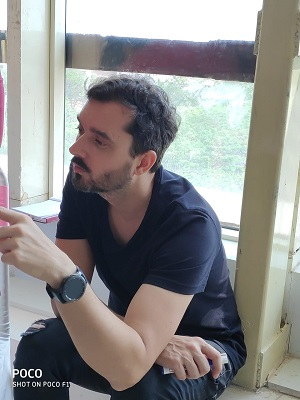
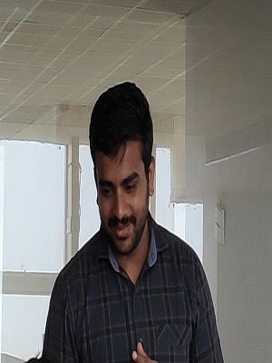

# Documentation of my experiences @ Fabzero, Bhubaneswar held at ELITE facility of STPI. 

Happy to be part of the STPI team, nominated for the Fabzero training for a duration of 3 weeks. The training is scheduled from 18th March to 5th April 2019. 

## Mentors
### Sh. Francisco Sanchez
A civil engineer aka structural expert by education and a passionate in fablab and its activities. It is our luck to have a cool mentor, knowledgeable and at the same time, listens to everyone in sorting out their issues. 

### Sh. Sibu Saman
A post graduate in Physics from CEBS, UM & DAE and an ex-employee of Fablab Kerala. Having profound skills in Linux, Arduino, R-Pi, Hardware, Programming, etc and familiar with all the equipments in the Fablab. Personally I am happy that I can speak to him in malayalam,the mother language, common to both of us.

## About Me

I am Mahesh Madhusudhanan Nair (Mahesh M.), a college drop out from the Masters of Engineering (Applied Electronics) from [CEG- Anna University](https://ceg.annauniv.edu/), Chennai India and an alumni of [Thiagarajar College of Engineering, Madurai](https://www.tce.edu/) and [Government Polytechnic, Nagercoil](http://www.gptnagercoil.com/).  
[_**...more details**_](aboutme.md)

### Inauguration of Fabzero

**Sh. Manas Panda**, Director, STPI, Bhubaneswar welcomed Director General, other colleagues from Delhi (VC), the instructors/mentors and the participants to the august occasion. He had taken us through the journey in setting-up of the Fablab in STPI-Bhubaneswar. The training program (Fabzero) was launched by **Dr. Omkar Rai**, Director General, STPI, followed with his inaugural address emphasizing the need and importance of Fablab across STPI, also urged each Directorates to set-up at least one such lab after ensuring the financial assistance from respective State Governments. 
[_**...more details**_](inaugural.md)

## [Vinyl Cutter](vinylplotter.md)

## [Day 1](day1.md)

## [Day 2](day2.md)

## [Day 3](day3.md)