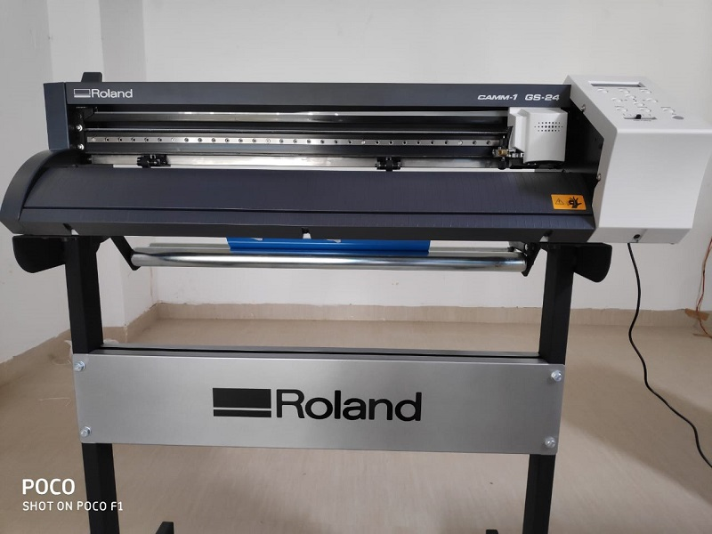

# Documentation of my experiences in Fab Zero, held at the ELITE facility of STPI, Bhubaneswar, India.

## `Introduction`
Profound thanks to the Almighty for the opportunity and the coincidental choice of the management to nominate me for the training, I am happy to be part of the STPI team, selected for the Fab Zero training for a duration of 3 weeks scheduled from 18th March to 5th April 2019. Here I will be documenting all my experiences, evolved out of the learning processes during these days for my future benefit, rather than for the mentor to evaluate me.

## `Inauguration of Fab Zero`

**Sh. Manas Panda**, Director, STPI, Bhubaneswar welcomed Director General, other colleagues from Delhi (VC), the instructors/mentors and the participants to the august occasion. He had taken us through the journey in setting-up of the Fablab in STPI-Bhubaneswar. The training program (Fab Zero) was launched by **Dr. Omkar Rai**, Director General, STPI, followed with his inaugural address emphasizing the need and importance of Fablab across STPI, 
[_**...more details**_](mdfiles/inaugural.md)

## `Mentors of Fab Zero`
The fourth iteration of the Pre Academy was rebranded as Fab Zero and it is anchored by two two mentors, whose details are provided in the below links.

### [**1.** Sh. Francisco Sanchez](mdfiles/francisco.md)
### [**2.** Sh. Sibu Saman](mdfiles/sibu.md)

## `About Me`

I am Mahesh Madhusudhanan Nair ( [Mahesh M.](mdfiles/certificatename.md "Certificate Name") ), a college drop out from the Masters of Engineering (Applied Electronics) from [CEG- Anna University](https://ceg.annauniv.edu/), Chennai India and an alumni of [Thiagarajar College of Engineering, Madurai](https://www.tce.edu/) and [Government Polytechnic, Nagercoil](http://www.gptnagercoil.com/).  

[_Read more..._](mdfiles/aboutme.md)

## `Fablab tour`

For the initial few days, the session will be conducted in the 4th floor of the facility keeping in view of the space constraints in the lab at first floor. Therefore, a tour was arranged to see the lab to get acquainted with all the equipment there. The lab pictures are here.

 

To see the entire tour details, [_click here_.](mdfiles/fablabtour.md "Tour details").   

 
## `Index` 

- **[Vinyl Cutting.](/mdfiles/vinylcutting.md)**  
- **Electronics Design** 
    - [Circuit Schema & PCB Layout designing.](/mdfiles/elecdesign.md)
    - [PCB Milling.](/mdfiles/milling.md)
    - [Components Soldering & Testing]()
- **[3D Designing & Printing](/mdfiles/3ddesign.md)**
- **[Shopbot Alpha]()**         
- **[Band Saw]()**          
- **[Scroll Saw]()**     
- **[High Pressure Cleaning Unit]()**    
- **[Shopbot Mini]()**   
- **[Vinyl Cutter]()**  
- **[Laser Cutter (CO2)]()**   
- **[Other Electronics Equipment]()**  
- **[Soldering Station]()**
- **[Consumables Rack]()**

# Please dont read further, as it is not properly updated. Just added the stuff in zig-zag way.

**Shopbot Alpha** - 3 Axis milling machine, 96"/48", subtractive model with resolution of 1/10th mm. Ideal for wooden materials and other soft metals like Aluminium, Brass, etc.         
**Band Saw** - 3966         
**Scroll Saw**     
**High Pressure Cleaning Unit**      

**Shopbot Mini** - 3 Axis milling machine, ideal for making small jobs.      
**Vinyl Cutter** - Can be used as plotter too. Though it is a 2 axis machine, it can even work as more than 2 axis machine, perhaps up to 2.5.   

    

**Laser Cutter** - CO2 type, 3 axis machine with the wavelength of 10.2 micrometer. Absorbing type materials can be used in this machine. It also has a 3 stage filtration system, which filters out hard dust, fine dust and gases in stages.        
**3D Printer** - Additive type, Fused _Filament_ Deposition. Same material for sacrificing material.    
**3D Printer** - Liquid resin gets solidified by exposure to UV rays. Stereo Lithography. Same sacrificing material.       
**3D Printer** - Inkjet based type. Different material can be used as sacrificing material.

We could also notice electronics lab equipments like Oscilloscope, Function Generator, Power Supply, etc. Further the consumable rack is also seen in the lab, Sh. Francisco stressed upon the need to rearrange everything in order, after our assignment.

###  Documentation Tips & Insight of Academany

Got to know that either Linux is preferred over the legacy OS for a smooth experience of Fablab training. And hardly none has Linux installed Laptops in the class and so it is agreed to work with virtual machines. All participants were asked to create a username in github portal and I created as nairstpi. Then under repository tab, a public repository is created with name as fabzero, wherein we need to put our daily works and activities, documented.

Mentor insists all of us to take note of all the happenings in the training in the notepad, systematically date-wise. Further it is required to be typed in a text editor and everyone was asked to download and use the Visual Studio Code and save the file as "README.md". 

Academany- The Academy of Almost Anything offers high level education across globe, directed by people leading the way in their field, constantly evolve to stay at the cutting edge development of research into tools, techniques and technologies.

Academany programs are distributed learning system with mentors rather teachers, inline with the nine principles of Joi Ito (MIT Media Lab).     

     

Mentors called it for the day, reiterating to complete the unfinished task as homework...

End of Day 1 @ 18:15 hrs...

## [Notings 1](day.md)

## [Notings 2](day.md)

## [Notings 3](day.md)

## [Fab Lab Inventory](https://docs.google.com/spreadsheets/d/1U-jcBWOJEjBT5A0N84IUubtcHKMEMtndQPLCkZCkVsU/pub?single=true&gid=0&output=html "Inventory")
