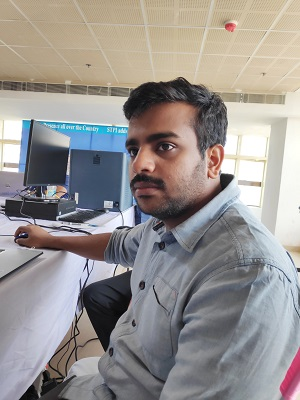

### `1. Sh. Sibu Saman`
A post graduate in Physics from CEBS, UM & DAE and an ex-employee of Fablab Kerala. Having profound skills in Linux, Arduino, R-Pi, Hardware, Programming, etc and familiar with all the equipments in the Fablab. Personally I am happy that I can speak to him in malayalam, the mother language, common to both of us.

[_Click here_](https://github.com/sibusaman/ "Details of Francisco Sanchez") to know more about `Sibu Saman`.